  # Report
  ## Using stemmer
  ### 11-points interpolated average precision
  | Recall | Precision | 
  ------------ | -------------
  0.0 | 0.5619016239409448
0.1 | 0.3452908669616793
0.2 | 0.2764925471583238
0.3 | 0.24912914689716192
0.4 | 0.24075550606561424
0.5 | 0.23732202877334616
0.6 | 0.2340000536082168
0.7 | 0.2340000536082168
0.8 | 0.2340000536082168
0.9 | 0.2340000536082168
1.0 | 0.2340000536082168

  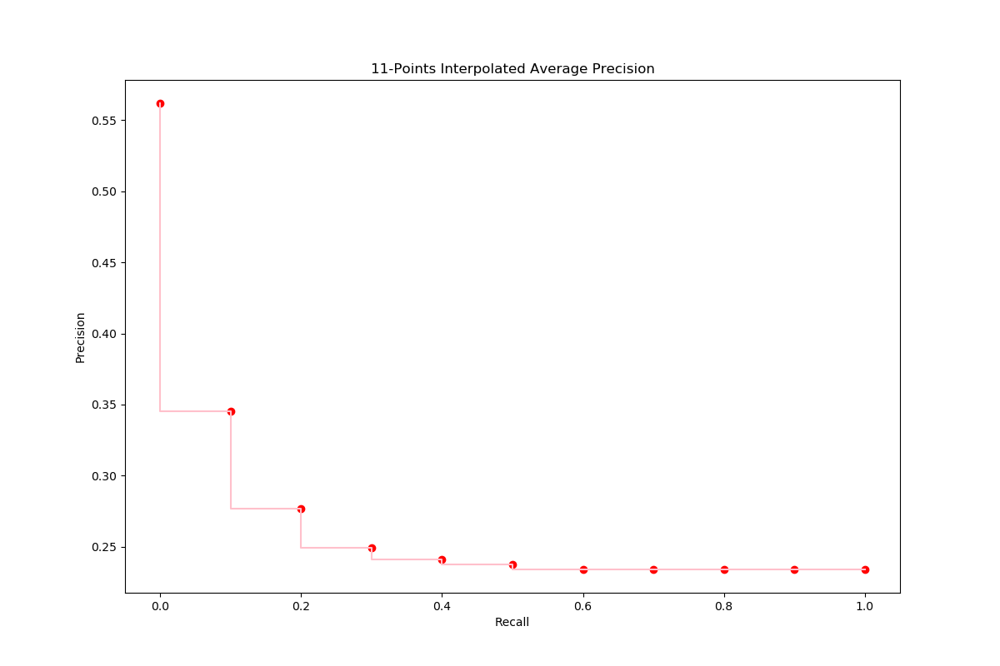
  
  ### F1
  | Query Number | F1 | 
  ------------ | -------------
  1 | 0.4186046511627907
2 | 0.0
3 | 0.49122807017543857
4 | 0.6153846153846153
5 | 0.7342995169082125
6 | 0.07999999999999999
7 | 0.35294117647058826
8 | 0.16666666666666669
9 | 0.5714285714285715
10 | 0.2758620689655173
11 | 0.8108108108108109
12 | 0.6
13 | 0.5
14 | 0.4057971014492754
15 | 0.23728813559322035
16 | 0.13471502590673573
17 | 0.45070422535211263
18 | 0.17391304347826084
19 | 0.6666666666666666
20 | 0.6857142857142856
21 | 0.43750000000000006
22 | 0.40909090909090906
23 | 0.25
24 | 0.45000000000000007
25 | 0.45454545454545453
26 | 0.7547169811320755
27 | 0.3076923076923077
28 | 0.3548387096774193
29 | 0.37037037037037035
30 | 0.6399999999999999
31 | 0.4109589041095891
32 | 0.23529411764705882
33 | 0.6265060240963854
34 | 0.2666666666666667
35 | 0.6666666666666666
36 | 0.7142857142857143
37 | 0.43199999999999994
38 | 0.641025641025641
39 | 0.5535714285714286
40 | 0.24096385542168672
41 | 0.7499999999999999
42 | 0.1923076923076923
43 | 0.2654867256637168
44 | 0.32335329341317365
45 | 0.4615384615384615
46 | 0.7142857142857143
47 | 0.37837837837837834
48 | 0.8
49 | 0.46808510638297873
50 | 0.2758620689655173
51 | 0.0326530612244898
52 | 0.0
53 | 0.5625
54 | 0.5909090909090909
55 | 0.0
56 | 0.17142857142857143
57 | 0.5833333333333334
58 | 0.6428571428571429
59 | 0.5990338164251208
60 | 0.21052631578947367
61 | 0.4444444444444445
62 | 0.6728110599078341
63 | 0.05
64 | 0.41269841269841273
65 | 0.7549668874172186
66 | 0.7010309278350516
67 | 0.782608695652174
68 | 0.732394366197183
69 | 0.33333333333333337
70 | 0.5833333333333334
71 | 0.8
72 | 0.47058823529411764
73 | 0.5
74 | 0.6
75 | 0.6451612903225806
76 | 0.3
77 | 0.2553191489361702
78 | 0.14457831325301204
79 | 0.5172413793103449
80 | 0.1621621621621622
81 | 0.4444444444444445
82 | 0.4878048780487805
83 | 0.358974358974359
84 | 0.72
85 | 0.45000000000000007
86 | 0.3793103448275862
87 | 0.4166666666666667
88 | 0.4444444444444445
89 | 0.21052631578947367
90 | 0.8085106382978724
91 | 0.2117647058823529
92 | 0.5974025974025974
94 | 0.46428571428571425
95 | 0.0
96 | 0.2857142857142857
97 | 0.625
98 | 0.125
99 | 0.5714285714285715
100 | 0.5333333333333333

  
**F1 average**: 
  0.440490307532059

  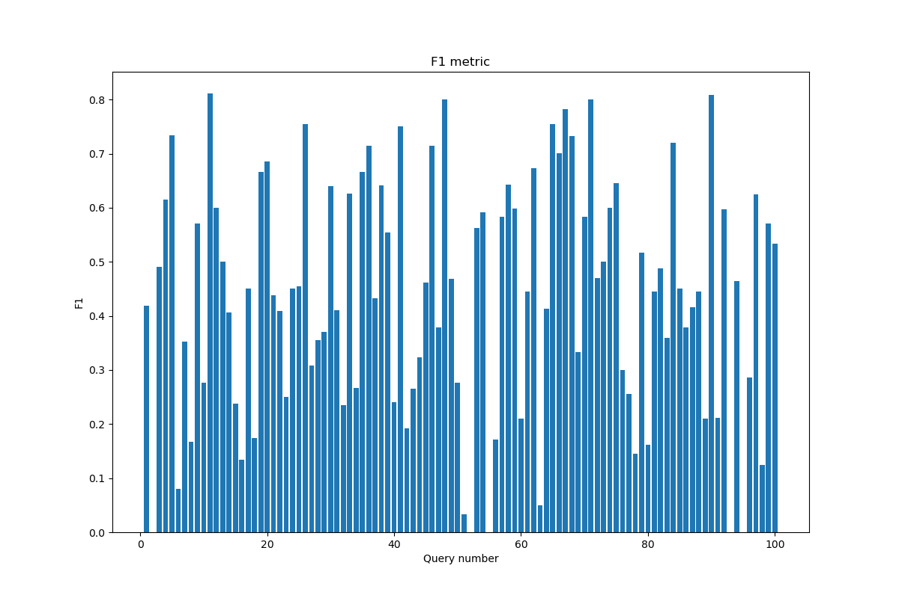
  
  
 ### Precision@5
  | Query Number | Precision@5 | 
  ------------ | -------------
  1 | 0.4
2 | 0.0
3 | 0.2
4 | 0.0
5 | 1.0
6 | 0.0
7 | 0.0
8 | 0.2
9 | 0.0
10 | 0.2
11 | 0.6
12 | 0.0
13 | 0.0
14 | 0.6
15 | 0.4
16 | 0.8
17 | 0.2
18 | 0.2
19 | 0.4
20 | 1.0
21 | 0.2
22 | 1.0
23 | 0.0
24 | 0.0
25 | 0.6
26 | 0.4
27 | 0.2
28 | 0.6
29 | 0.2
30 | 0.0
31 | 0.2
32 | 0.0
33 | 0.6
34 | 0.6
35 | 0.0
36 | 0.0
37 | 0.8
38 | 0.4
39 | 1.0
40 | 0.8
41 | 0.2
42 | 0.2
43 | 0.4
44 | 0.6
45 | 0.2
46 | 0.2
47 | 0.4
48 | 0.2
49 | 0.8
50 | 0.4
51 | 0.4
52 | 0.0
53 | 0.4
54 | 0.4
55 | 0.0
56 | 0.4
57 | 0.6
58 | 0.6
59 | 0.2
60 | 0.0
61 | 0.6
62 | 0.4
63 | 0.0
64 | 0.4
65 | 0.6
66 | 0.2
67 | 0.6
68 | 0.0
69 | 0.0
70 | 0.0
71 | 0.2
72 | 0.4
73 | 0.2
74 | 0.0
75 | 0.8
76 | 0.2
77 | 0.4
78 | 0.6
79 | 0.8
80 | 0.6
81 | 0.4
82 | 0.2
83 | 0.4
84 | 0.4
85 | 0.0
86 | 0.6
87 | 0.2
88 | 0.0
89 | 0.4
90 | 0.4
91 | 0.8
92 | 0.8
94 | 1.0
95 | 0.0
96 | 0.0
97 | 0.4
98 | 0.2
99 | 0.0
100 | 0.0

  
**Precision@5 average**: 
  0.33939393939393925

  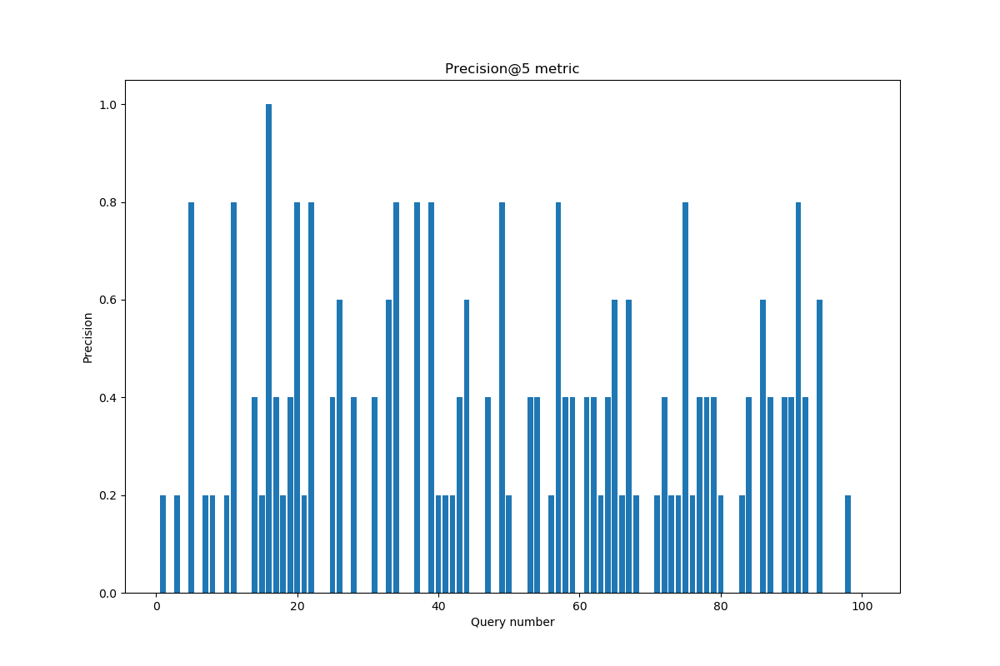
  
  
 ### Precision@10
  | Query Number | Precision@10 | 
  ------------ | -------------
  1 | 0.3
2 | 0.0
3 | 0.1
4 | 0.0
5 | 0.6
6 | 0.0
7 | 0.0
8 | 0.1
9 | 0.1
10 | 0.1
11 | 0.5
12 | 0.0
13 | 0.1
14 | 0.4
15 | 0.2
16 | 0.8
17 | 0.2
18 | 0.2
19 | 0.2
20 | 0.7
21 | 0.1
22 | 0.7
23 | 0.0
24 | 0.0
25 | 0.5
26 | 0.3
27 | 0.1
28 | 0.3
29 | 0.3
30 | 0.0
31 | 0.3
32 | 0.1
33 | 0.4
34 | 0.4
35 | 0.0
36 | 0.0
37 | 0.9
38 | 0.2
39 | 0.7
40 | 0.7
41 | 0.1
42 | 0.1
43 | 0.2
44 | 0.7
45 | 0.1
46 | 0.2
47 | 0.2
48 | 0.1
49 | 0.7
50 | 0.2
51 | 0.3
52 | 0.0
53 | 0.3
54 | 0.3
55 | 0.0
56 | 0.2
57 | 0.5
58 | 0.5
59 | 0.3
60 | 0.0
61 | 0.4
62 | 0.5
63 | 0.1
64 | 0.5
65 | 0.6
66 | 0.2
67 | 0.4
68 | 0.1
69 | 0.0
70 | 0.0
71 | 0.1
72 | 0.2
73 | 0.1
74 | 0.1
75 | 0.4
76 | 0.1
77 | 0.2
78 | 0.6
79 | 0.5
80 | 0.3
81 | 0.2
82 | 0.1
83 | 0.2
84 | 0.4
85 | 0.0
86 | 0.6
87 | 0.2
88 | 0.0
89 | 0.2
90 | 0.3
91 | 0.6
92 | 0.7
94 | 0.8
95 | 0.0
96 | 0.0
97 | 0.2
98 | 0.1
99 | 0.0
100 | 0.0

  
**Precision@10 average**: 
  0.2585858585858586

  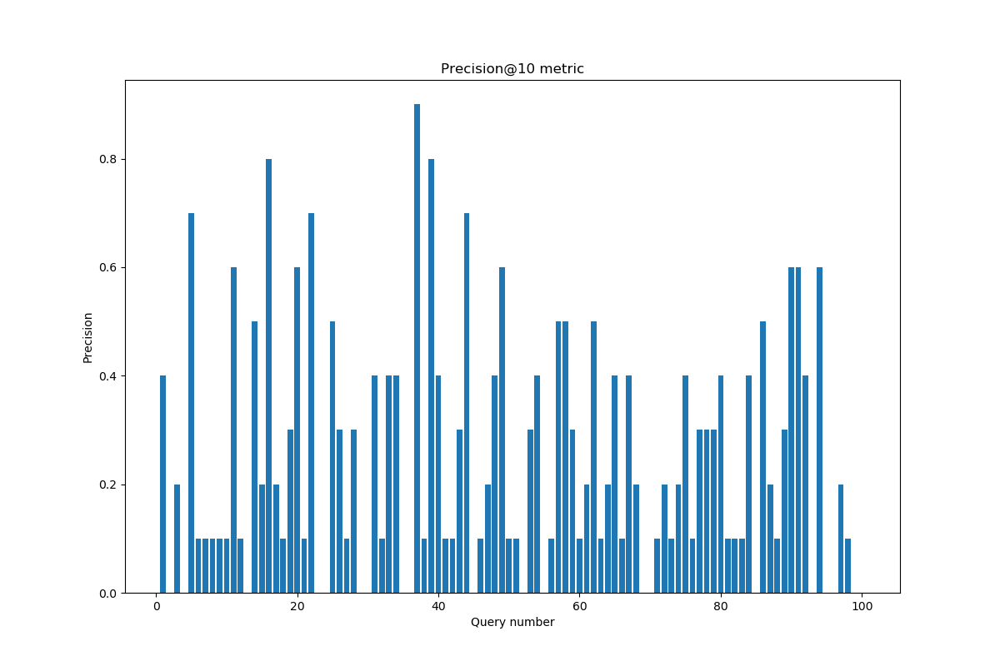
  
  
 ### R-Precision
  | Query Number | R-Precision | 
  ------------ | -------------
  1 | 0.20588235294117646
2 | 0.0
3 | 0.06976744186046512
4 | 0.0
5 | 0.2366412213740458
6 | 0.058823529411764705
7 | 0.0
8 | 0.045454545454545456
9 | 0.1
10 | 0.08
11 | 0.4090909090909091
12 | 0.0
13 | 0.08333333333333333
14 | 0.2545454545454545
15 | 0.32558139534883723
16 | 0.6190476190476191
17 | 0.16363636363636364
18 | 0.13333333333333333
19 | 0.22727272727272727
20 | 0.34782608695652173
21 | 0.12
22 | 0.21428571428571427
23 | 0.02857142857142857
24 | 0.03225806451612903
25 | 0.27450980392156865
26 | 0.12121212121212122
27 | 0.18181818181818182
28 | 0.3055555555555556
29 | 0.20454545454545456
30 | 0.058823529411764705
31 | 0.22413793103448276
32 | 0.03333333333333333
33 | 0.2807017543859649
34 | 0.42857142857142855
35 | 0.0
36 | 0.0
37 | 0.627906976744186
38 | 0.16981132075471697
39 | 0.36419753086419754
40 | 0.35714285714285715
41 | 0.06666666666666667
42 | 0.10638297872340426
43 | 0.5
44 | 0.675
45 | 0.05
46 | 0.16666666666666666
47 | 0.1
48 | 0.3
49 | 0.2222222222222222
50 | 0.16
51 | 0.25
52 | 0.0
53 | 0.2608695652173913
54 | 0.22580645161290322
55 | 0.0
56 | 0.0625
57 | 0.35294117647058826
58 | 0.3157894736842105
59 | 0.1724137931034483
60 | 0.029411764705882353
61 | 0.2714285714285714
62 | 0.2569444444444444
63 | 0.02857142857142857
64 | 0.18
65 | 0.22340425531914893
66 | 0.1746031746031746
67 | 0.35714285714285715
68 | 0.1111111111111111
69 | 0.0
70 | 0.058823529411764705
71 | 0.16666666666666666
72 | 0.15384615384615385
73 | 0.05555555555555555
74 | 0.14285714285714285
75 | 0.2857142857142857
76 | 0.058823529411764705
77 | 0.12195121951219512
78 | 0.6
79 | 0.18604651162790697
80 | 0.21428571428571427
81 | 0.14285714285714285
82 | 0.14516129032258066
83 | 0.3181818181818182
84 | 0.25
85 | 0.06451612903225806
86 | 0.39285714285714285
87 | 0.13157894736842105
88 | 0.07142857142857142
89 | 0.2
90 | 0.32142857142857145
91 | 0.3870967741935484
92 | 0.2037037037037037
94 | 0.43333333333333335
95 | 0.0
96 | 0.0
97 | 0.18181818181818182
98 | 0.06666666666666667
99 | 0.0
100 | 0.0

  
**R-Precision average**: 
  0.18548176246516557

  
 ### MAP

  0.2909083216669954

  
 ### MRR

  0.13740503834684703

  
 ### DCG
  | Query Number | DCG | 
  ------------ | -------------
  1 | [2, 2, 9.57115704285749, 9.57115704285749, 9.57115704285749, 9.57115704285749, 10.995985791289579, 10.995985791289579, 10.995985791289579, 10.995985791289579]
2 | [0, 0, 0, 0, 0, 0, 0, 0, 0, 0]
3 | [0, 0, 1.261859507142915, 1.261859507142915, 1.261859507142915, 1.261859507142915, 1.261859507142915, 1.261859507142915, 1.261859507142915, 1.261859507142915]
4 | [0, 0, 0, 0, 0, 0, 0, 0, 0, 0]
5 | [1, 8.0, 9.261859507142916, 10.261859507142916, 11.123212623289701, 11.123212623289701, 11.835626997505745, 11.835626997505745, 11.835626997505745, 11.835626997505745]
6 | [0, 0, 0, 0, 0, 0, 0, 0, 0, 0]
7 | [0, 0, 0, 0, 0, 0, 0, 0, 0, 0]
8 | [3, 3, 3, 3, 3, 3, 3, 3, 3, 3]
9 | [0, 0, 0, 0, 0, 0, 0, 0, 0.31546487678572877, 0.31546487678572877]
10 | [0, 11.0, 11.0, 11.0, 11.0, 11.0, 11.0, 11.0, 11.0, 11.0]
11 | [11, 23.0, 23.0, 23.0, 28.16811869688072, 28.554971504115258, 28.554971504115258, 28.554971504115258, 28.870436380900987, 28.870436380900987]
12 | [0, 0, 0, 0, 0, 0, 0, 0, 0, 0]
13 | [0, 0, 0, 0, 0, 0, 0, 0.6666666666666666, 0.6666666666666666, 0.6666666666666666]
14 | [12, 16.0, 16.0, 16.0, 17.72270623229357, 18.496411846762655, 18.496411846762655, 18.496411846762655, 18.496411846762655, 18.496411846762655]
15 | [0, 0, 0, 5.5, 6.79202967422018, 6.79202967422018, 6.79202967422018, 6.79202967422018, 6.79202967422018, 6.79202967422018]
16 | [4, 6.0, 13.57115704285749, 13.57115704285749, 17.447246065518026, 19.768362908925276, 21.549398844465387, 22.216065511132054, 22.846995264703512, 22.846995264703512]
17 | [0, 0, 1.261859507142915, 1.261859507142915, 1.261859507142915, 1.261859507142915, 1.261859507142915, 1.261859507142915, 4.731973151785931, 4.731973151785931]
18 | [0, 6.0, 6.0, 6.0, 6.0, 6.0, 6.0, 6.0, 7.2618595071429155, 7.2618595071429155]
19 | [1, 1, 8.57115704285749, 8.57115704285749, 8.57115704285749, 8.57115704285749, 8.57115704285749, 8.57115704285749, 8.57115704285749, 8.57115704285749]
20 | [12, 24.0, 31.57115704285749, 37.57115704285749, 42.73927573973821, 47.38150942655271, 51.29978848474096, 51.29978848474096, 51.29978848474096, 51.29978848474096]
21 | [0, 2.0, 2.0, 2.0, 2.0, 2.0, 2.0, 2.0, 2.0, 2.0]
22 | [1, 6.0, 9.154648767857287, 12.654648767857287, 13.516001884004073, 15.450265920176781, 15.450265920176781, 15.450265920176781, 16.081195673748237, 16.081195673748237]
23 | [0, 0, 0, 0, 0, 0, 0, 0, 0, 0]
24 | [0, 0, 0, 0, 0, 0, 0, 0, 0, 0]
25 | [0, 0, 6.940227289286033, 8.440227289286032, 9.301580405432817, 13.943814092247317, 13.943814092247317, 16.610480758913983, 16.610480758913983, 16.610480758913983]
26 | [0, 9.0, 9.0, 11.5, 11.5, 11.5, 11.5, 15.166666666666666, 15.166666666666666, 15.166666666666666]
27 | [0, 0, 0, 5.5, 5.5, 5.5, 5.5, 5.5, 5.5, 5.5]
28 | [2, 6.0, 6.0, 7.0, 7.0, 7.0, 7.0, 7.0, 7.0, 7.0]
29 | [0, 0, 0, 4.5, 4.5, 4.886852807234542, 9.161339052530808, 9.161339052530808, 9.161339052530808, 9.161339052530808]
30 | [0, 0, 0, 0, 0, 0, 0, 0, 0, 0]
31 | [0, 0, 0, 6.0, 6.0, 10.6422336868145, 10.6422336868145, 10.6422336868145, 10.6422336868145, 13.652533643454312]
32 | [0, 0, 0, 0, 0, 0, 0, 2.6666666666666665, 2.6666666666666665, 2.6666666666666665]
33 | [10, 22.0, 22.0, 28.0, 28.0, 28.0, 31.205864683972198, 31.205864683972198, 31.205864683972198, 31.205864683972198]
34 | [9, 21.0, 21.0, 27.0, 30.876089022660537, 35.518322709475036, 35.518322709475036, 39.518322709475036, 42.672971477332325, 42.672971477332325]
35 | [0, 0, 0, 0, 0, 0, 0, 0, 0, 0]
36 | [0, 0, 0, 0, 0, 0, 0, 0, 0, 0]
37 | [12, 24.0, 30.309297535714574, 35.30929753571458, 35.30929753571458, 39.95153122252908, 44.22601746782534, 48.22601746782534, 50.749736482111174, 54.36209643007895]
38 | [9, 9, 9, 9, 9.861353116146786, 9.861353116146786, 9.861353116146786, 9.861353116146786, 9.861353116146786, 9.861353116146786]
39 | [4, 8.0, 11.785578521428745, 13.785578521428745, 15.077608195648924, 15.851313810118008, 15.851313810118008, 15.851313810118008, 15.851313810118008, 17.055433792773933]
40 | [9, 9, 16.57115704285749, 22.07115704285749, 22.501833600930883, 23.275539215399967, 23.275539215399967, 26.942205882066634, 30.412319526709652, 30.412319526709652]
41 | [0, 12.0, 12.0, 12.0, 12.0, 12.0, 12.0, 12.0, 12.0, 12.0]
42 | [1, 1, 1, 1, 1, 1, 1, 1, 1, 1]
43 | [0, 12.0, 13.261859507142916, 13.261859507142916, 13.261859507142916, 13.261859507142916, 13.261859507142916, 13.261859507142916, 13.261859507142916, 13.261859507142916]
44 | [12, 24.0, 24.0, 27.5, 27.5, 27.5, 29.993450309756156, 33.993450309756156, 37.7790288311849, 41.39138877915268]
45 | [2, 2, 2, 2, 2, 2, 2, 2, 2, 2]
46 | [0, 0, 0, 6.0, 6.0, 6.0, 6.712414374216045, 6.712414374216045, 6.712414374216045, 6.712414374216045]
47 | [12, 12, 12, 12.5, 12.5, 12.5, 12.5, 12.5, 12.5, 12.5]
48 | [1, 1, 1, 1, 1, 1, 1, 1, 1, 1]
49 | [8, 8, 8.630929753571458, 13.630929753571458, 17.0763422181586, 20.171164676034934, 23.377029360007132, 27.377029360007132, 27.377029360007132, 27.377029360007132]
50 | [6, 6, 13.57115704285749, 13.57115704285749, 13.57115704285749, 13.57115704285749, 13.57115704285749, 13.57115704285749, 13.57115704285749, 13.57115704285749]
51 | [2, 2, 2, 7.0, 7.0, 8.547411228938167, 9.25982560315421, 9.25982560315421, 9.25982560315421, 12.270125559794023]
52 | [0, 0, 0, 0, 0, 0, 0, 0, 0, 0]
53 | [5, 5, 6.892789260714372, 6.892789260714372, 6.892789260714372, 7.666494875183456, 7.666494875183456, 7.666494875183456, 7.666494875183456, 7.666494875183456]
54 | [0, 11.0, 11.0, 17.0, 17.0, 17.0, 17.0, 17.0, 19.208254137500102, 19.208254137500102]
55 | [0, 0, 0, 0, 0, 0, 0, 0, 0, 0]
56 | [0, 0, 0, 0.5, 0.9306765580733931, 0.9306765580733931, 0.9306765580733931, 0.9306765580733931, 0.9306765580733931, 0.9306765580733931]
57 | [3, 3, 7.4165082750002025, 7.4165082750002025, 9.139214507293774, 10.299772928997399, 10.299772928997399, 10.299772928997399, 12.192562189711772, 12.192562189711772]
58 | [0, 7.0, 12.678367782143116, 12.678367782143116, 14.831750572510082, 15.218603379744623, 15.218603379744623, 15.218603379744623, 19.004181901173368, 19.004181901173368]
59 | [0, 5.0, 5.0, 5.0, 5.0, 5.0, 5.0, 5.0, 5.315464876785729, 6.519584859441654]
60 | [0, 0, 0, 0, 0, 0, 0, 0, 0, 0]
61 | [11, 11, 11, 14.5, 15.361353116146786, 18.84302838125766, 18.84302838125766, 18.84302838125766, 18.84302838125766, 18.84302838125766]
62 | [0, 0, 3.1546487678572874, 3.1546487678572874, 4.016001884004074, 4.789707498473157, 4.789707498473157, 4.789707498473157, 5.105172375258886, 5.707232366586848]
63 | [0, 0, 0, 0, 0, 0.38685280723454163, 0.38685280723454163, 0.38685280723454163, 0.38685280723454163, 0.38685280723454163]
64 | [2, 2, 3.261859507142915, 3.261859507142915, 3.261859507142915, 3.261859507142915, 7.536345752439182, 8.203012419105848, 11.988590940534593, 11.988590940534593]
65 | [5, 5, 5, 10.5, 11.361353116146786, 14.069322766788577, 14.069322766788577, 18.069322766788577, 21.85490128821732, 21.85490128821732]
66 | [0, 0, 3.7855785214287447, 3.7855785214287447, 3.7855785214287447, 3.7855785214287447, 3.7855785214287447, 3.7855785214287447, 4.101043398214474, 4.101043398214474]
67 | [0, 1.0, 1.0, 5.0, 9.737442138807324, 11.284853367745491, 11.284853367745491, 11.284853367745491, 11.284853367745491, 11.284853367745491]
68 | [0, 0, 0, 0, 0, 0, 0, 4.0, 4.0, 4.0]
69 | [0, 0, 0, 0, 0, 0, 0, 0, 0, 0]
70 | [0, 0, 0, 0, 0, 0, 0, 0, 0, 0]
71 | [0, 0, 7.5711570428574895, 7.5711570428574895, 7.5711570428574895, 7.5711570428574895, 7.5711570428574895, 7.5711570428574895, 7.5711570428574895, 7.5711570428574895]
72 | [0, 0, 1.261859507142915, 1.261859507142915, 2.984565739436487, 2.984565739436487, 2.984565739436487, 2.984565739436487, 2.984565739436487, 2.984565739436487]
73 | [0, 9.0, 9.0, 9.0, 9.0, 9.0, 9.0, 9.0, 9.0, 9.0]
74 | [0, 0, 0, 0, 0, 0, 4.274486245296266, 4.274486245296266, 4.274486245296266, 4.274486245296266]
75 | [2, 2, 3.261859507142915, 5.2618595071429155, 6.123212623289701, 6.123212623289701, 6.123212623289701, 6.123212623289701, 6.123212623289701, 6.123212623289701]
76 | [0, 0, 6.940227289286033, 6.940227289286033, 6.940227289286033, 6.940227289286033, 6.940227289286033, 6.940227289286033, 6.940227289286033, 6.940227289286033]
77 | [0, 9.0, 16.57115704285749, 16.57115704285749, 16.57115704285749, 16.57115704285749, 16.57115704285749, 16.57115704285749, 16.57115704285749, 16.57115704285749]
78 | [0, 12.0, 13.261859507142916, 15.261859507142916, 15.261859507142916, 15.648712314377457, 19.92319855967372, 19.92319855967372, 19.92319855967372, 21.72937853365761]
79 | [3, 3, 8.04743802857166, 11.54743802857166, 11.978114586645054, 12.364967393879596, 12.364967393879596, 12.364967393879596, 12.364967393879596, 12.364967393879596]
80 | [0, 11.0, 18.57115704285749, 21.07115704285749, 21.07115704285749, 25.326537922437446, 29.601024167733712, 31.26769083440038, 31.26769083440038, 31.26769083440038]
81 | [0, 11.0, 11.0, 14.5, 14.5, 14.5, 14.5, 14.5, 14.5, 14.5]
82 | [0, 0, 6.940227289286033, 6.940227289286033, 6.940227289286033, 6.940227289286033, 6.940227289286033, 6.940227289286033, 6.940227289286033, 6.940227289286033]
83 | [0, 1.0, 2.261859507142915, 2.261859507142915, 2.261859507142915, 2.261859507142915, 2.261859507142915, 2.261859507142915, 2.261859507142915, 2.261859507142915]
84 | [0, 10.0, 12.523719014285831, 12.523719014285831, 12.523719014285831, 14.071130243223998, 15.852166178764108, 15.852166178764108, 15.852166178764108, 15.852166178764108]
85 | [0, 0, 0, 0, 0, 0, 0, 0, 0, 0]
86 | [0, 2.0, 2.0, 3.5, 6.084059348440359, 6.084059348440359, 6.084059348440359, 9.417392681773693, 10.04832243534515, 10.349352431009132]
87 | [0, 2.0, 2.0, 2.0, 2.0, 2.7737056144690833, 2.7737056144690833, 2.7737056144690833, 2.7737056144690833, 2.7737056144690833]
88 | [0, 0, 0, 0, 0, 0, 0, 0, 0, 0]
89 | [12, 23.0, 23.0, 23.0, 23.0, 23.0, 23.0, 23.0, 23.0, 23.0]
90 | [9, 9, 15.309297535714574, 15.309297535714574, 15.309297535714574, 15.309297535714574, 15.309297535714574, 15.309297535714574, 15.309297535714574, 15.911357527042536]
91 | [2, 4.0, 5.892789260714372, 5.892789260714372, 6.754142376861158, 7.914700798564783, 7.914700798564783, 7.914700798564783, 7.914700798564783, 9.118820781220707]
92 | [3, 7.0, 9.523719014285831, 12.023719014285831, 12.023719014285831, 12.797424628754914, 12.797424628754914, 13.46409129542158, 14.095021048993038, 14.095021048993038]
94 | [7, 19.0, 26.57115704285749, 32.57115704285749, 37.30859918166482, 41.56398006124478, 45.482259119433024, 45.482259119433024, 45.482259119433024, 46.68637910208895]
95 | [0, 0, 0, 0, 0, 0, 0, 0, 0, 0]
96 | [0, 0, 0, 0, 0, 0, 0, 0, 0, 0]
97 | [0, 0, 1.261859507142915, 1.261859507142915, 4.276595413656667, 4.276595413656667, 4.276595413656667, 4.276595413656667, 4.276595413656667, 4.276595413656667]
98 | [0, 0, 4.4165082750002025, 4.4165082750002025, 4.4165082750002025, 4.4165082750002025, 4.4165082750002025, 4.4165082750002025, 4.4165082750002025, 4.4165082750002025]
99 | [0, 0, 0, 0, 0, 0, 0, 0, 0, 0]
100 | [0, 0, 0, 0, 0, 0, 0, 0, 0, 0]

  
**DCG average@10**: 
  10.476123679688685

  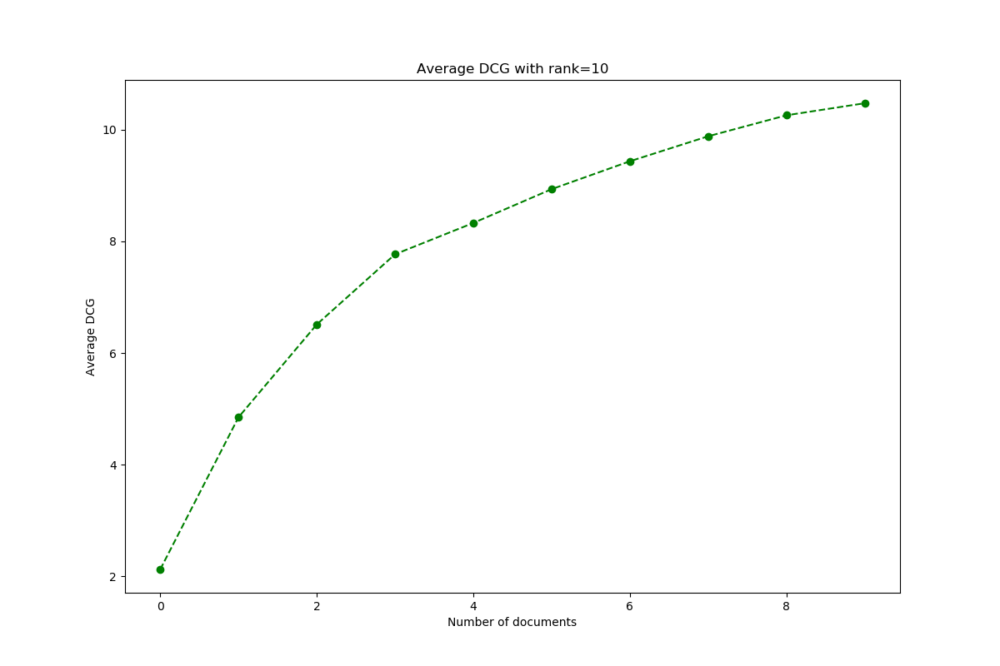
  
  
 ### nDCG
  | Query Number | nDCG | 
  ------------ | -------------
  1 | 0.6370105020689959
2 | 0
3 | 0.6309297535714575
4 | 0
5 | 0.9460883368864814
6 | 0
7 | 0
8 | 1.0
9 | 0.31546487678572877
10 | 1.0
11 | 0.9058555891345694
12 | 0
13 | 0.3333333333333333
14 | 0.9473815840736348
15 | 0.48514497673001283
16 | 0.7331902990360742
17 | 0.36399793475276393
18 | 0.7261859507142916
19 | 0.6593197725274992
20 | 1.0
21 | 1.0
22 | 0.8185516394179796
23 | 0
24 | 0
25 | 0.5462394305601647
26 | 0.6550160539563294
27 | 0.5
28 | 0.9639404333166532
29 | 0.4235296012192074
30 | 0
31 | 0.45044045073519184
32 | 0.3333333333333333
33 | 0.8964807362732548
34 | 0.878669103861113
35 | 0
36 | 0
37 | 0.9570684857073424
38 | 0.8964866469224351
39 | 0.9412803754722089
40 | 0.7519197757929167
41 | 1.0
42 | 1.0
43 | 0.9472756790816368
44 | 0.863387319993254
45 | 1.0
46 | 0.4794581695868603
47 | 0.9615384615384616
48 | 1.0
49 | 0.7097126191122817
50 | 0.7539531690476383
51 | 0.5031818439643195
52 | 0
53 | 0.827748992442707
54 | 0.7006090616949637
55 | 0
56 | 0.46533827903669656
57 | 0.6656873490169243
58 | 0.6704080850737799
59 | 0.6769424163875749
60 | 0
61 | 0.7413696711358165
62 | 0.5888275605255103
63 | 0.38685280723454163
64 | 0.4420048283749555
65 | 0.5848667714618614
66 | 0.5858633426020676
67 | 0.5123954478544471
68 | 0.3333333333333333
69 | 0
70 | 0
71 | 0.6309297535714574
72 | 0.49742762323941453
73 | 1.0
74 | 0.3562071871080222
75 | 0.7411421869369462
76 | 0.6309297535714575
77 | 0.7891027163265472
78 | 0.7001846188724017
79 | 0.6937465204351921
80 | 0.7715107568938753
81 | 0.8055555555555556
82 | 0.6309297535714575
83 | 0.7539531690476383
84 | 0.8119439829657871
85 | 0
86 | 0.5138451370655944
87 | 0.6934264036172708
88 | 0
89 | 1.0
90 | 0.785286144217578
91 | 0.7910254184543989
92 | 0.9169764413693403
94 | 0.9357719873514997
95 | 0
96 | 0
97 | 0.4751772681840741
98 | 0.6309297535714575
99 | 0
100 | 0

  
**nDCG average**: 
  0.5621577405718139

  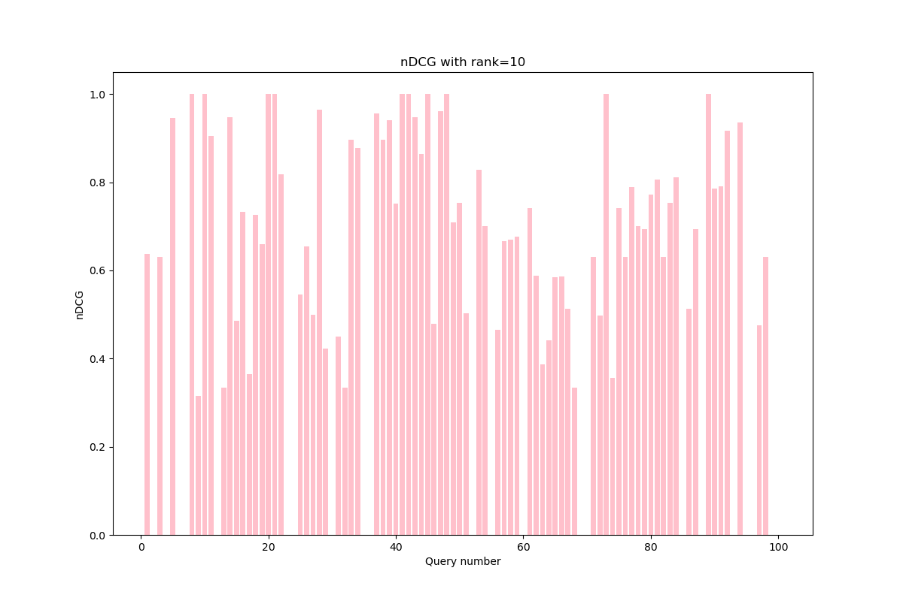
  
  ## Without stemmer
  ### 11-points interpolated average precision
  | Recall | Precision | 
  ------------ | -------------
  0.0 | 0.5400263647314614
0.1 | 0.36537302205547184
0.2 | 0.3181404195178408
0.3 | 0.2946655003961872
0.4 | 0.28938773067577983
0.5 | 0.28603528847207416
0.6 | 0.2823422692347575
0.7 | 0.2823422692347575
0.8 | 0.2823422692347575
0.9 | 0.2823422692347575
1.0 | 0.2823422692347575

  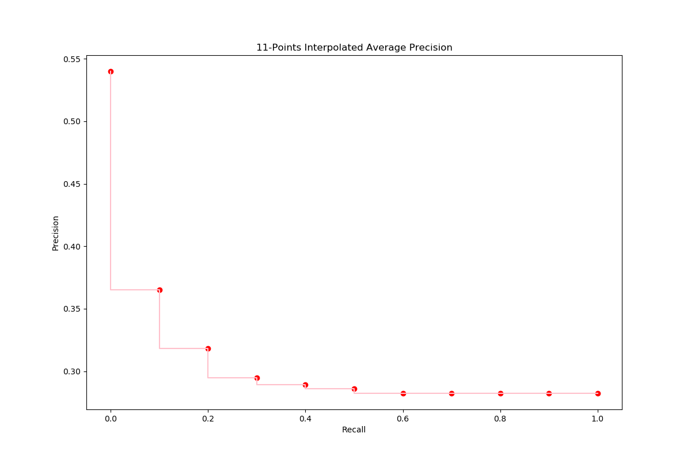
  
  ### F1
  | Query Number | F1 | 
  ------------ | -------------
  1 | 0.38095238095238093
2 | 0.0
3 | 0.37735849056603776
4 | 0.5
5 | 0.6834170854271356
6 | 0.07999999999999999
7 | 0.13333333333333333
8 | 0.16666666666666669
9 | 0.33333333333333337
10 | 0.33333333333333337
11 | 0.8108108108108109
12 | 0.4444444444444445
13 | 0.4
14 | 0.33333333333333337
15 | 0.1592920353982301
16 | 0.125
17 | 0.3076923076923077
18 | 0.0909090909090909
19 | 0.5806451612903226
20 | 0.6060606060606061
21 | 0.07692307692307693
22 | 0.271604938271605
23 | 0.0
24 | 0.3243243243243243
25 | 0.43076923076923085
26 | 0.7058823529411764
27 | 0.3076923076923077
28 | 0.3278688524590164
29 | 0.16666666666666669
30 | 0.5217391304347826
31 | 0.21538461538461542
32 | 0.23529411764705882
33 | 0.34782608695652173
34 | 0.18604651162790695
35 | 0.6
36 | 0.7142857142857143
37 | 0.3103448275862069
38 | 0.5070422535211268
39 | 0.46445497630331756
40 | 0.10389610389610389
41 | 0.6956521739130436
42 | 0.08163265306122448
43 | 0.1851851851851852
44 | 0.15789473684210528
45 | 0.4
46 | 0.56
47 | 0.2857142857142857
48 | 0.6666666666666666
49 | 0.4
50 | 0.07692307692307693
51 | 0.008264462809917356
52 | 0.0
53 | 0.5161290322580645
54 | 0.5411764705882353
55 | 0.0
56 | 0.17142857142857143
57 | 0.47761194029850745
58 | 0.5606060606060607
59 | 0.5499999999999999
60 | 0.21052631578947367
61 | 0.42696629213483145
62 | 0.6086956521739131
63 | 0.05
64 | 0.2758620689655173
65 | 0.6944444444444444
66 | 0.5681818181818182
67 | 0.782608695652174
68 | 0.5245901639344263
69 | 0.125
70 | 0.5833333333333334
71 | 0.8
72 | 0.47058823529411764
73 | 0.6153846153846153
74 | 0.4444444444444445
75 | 0.6
76 | 0.21052631578947367
77 | 0.07058823529411765
78 | 0.07500000000000001
79 | 0.43636363636363634
80 | 0.21052631578947367
81 | 0.30303030303030304
82 | 0.45000000000000007
83 | 0.2702702702702703
84 | 0.7692307692307693
85 | 0.12121212121212122
86 | 0.4067796610169491
87 | 0.4166666666666667
88 | 0.35294117647058826
89 | 0.3
90 | 0.7555555555555554
91 | 0.17964071856287428
92 | 0.56
94 | 0.37735849056603776
95 | 0.19999999999999998
96 | 0.2857142857142857
97 | 0.625
98 | 0.125
99 | 0.0
100 | 0.5333333333333333

  
**F1 average**: 
  0.36176644194077406

  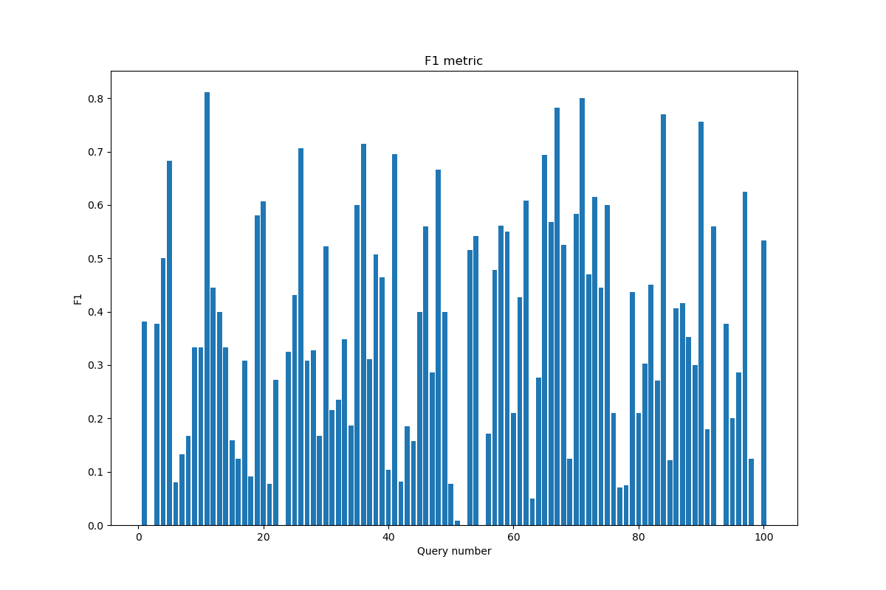
  
  
 ### Precision@5
  | Query Number | Precision@5 | 
  ------------ | -------------
  1 | 0.2
2 | 0.0
3 | 0.2
4 | 0.0
5 | 0.8
6 | 0.0
7 | 0.2
8 | 0.2
9 | 0.0
10 | 0.2
11 | 0.8
12 | 0.0
13 | 0.0
14 | 0.4
15 | 0.2
16 | 1.0
17 | 0.4
18 | 0.2
19 | 0.4
20 | 0.8
21 | 0.2
22 | 0.8
23 | 0.0
24 | 0.0
25 | 0.4
26 | 0.6
27 | 0.0
28 | 0.4
29 | 0.0
30 | 0.0
31 | 0.4
32 | 0.0
33 | 0.6
34 | 0.8
35 | 0.0
36 | 0.0
37 | 0.8
38 | 0.0
39 | 0.8
40 | 0.2
41 | 0.2
42 | 0.2
43 | 0.4
44 | 0.6
45 | 0.0
46 | 0.0
47 | 0.4
48 | 0.0
49 | 0.8
50 | 0.2
51 | 0.0
52 | 0.0
53 | 0.4
54 | 0.4
55 | 0.0
56 | 0.2
57 | 0.8
58 | 0.4
59 | 0.4
60 | 0.0
61 | 0.4
62 | 0.4
63 | 0.2
64 | 0.4
65 | 0.6
66 | 0.2
67 | 0.6
68 | 0.2
69 | 0.0
70 | 0.0
71 | 0.2
72 | 0.4
73 | 0.2
74 | 0.2
75 | 0.8
76 | 0.2
77 | 0.4
78 | 0.4
79 | 0.4
80 | 0.2
81 | 0.0
82 | 0.0
83 | 0.2
84 | 0.4
85 | 0.0
86 | 0.6
87 | 0.4
88 | 0.0
89 | 0.4
90 | 0.4
91 | 0.8
92 | 0.4
94 | 0.6
95 | 0.0
96 | 0.0
97 | 0.0
98 | 0.2
99 | 0.0
100 | 0.0

  
**Precision@5 average**: 
  0.2848484848484847

  
  
  
 ### Precision@10
  | Query Number | Precision@10 | 
  ------------ | -------------
  1 | 0.4
2 | 0.0
3 | 0.2
4 | 0.0
5 | 0.7
6 | 0.1
7 | 0.1
8 | 0.1
9 | 0.1
10 | 0.1
11 | 0.6
12 | 0.1
13 | 0.0
14 | 0.5
15 | 0.2
16 | 0.8
17 | 0.2
18 | 0.1
19 | 0.3
20 | 0.6
21 | 0.1
22 | 0.7
23 | 0.0
24 | 0.0
25 | 0.5
26 | 0.3
27 | 0.1
28 | 0.3
29 | 0.0
30 | 0.0
31 | 0.4
32 | 0.1
33 | 0.4
34 | 0.4
35 | 0.0
36 | 0.0
37 | 0.9
38 | 0.1
39 | 0.8
40 | 0.4
41 | 0.1
42 | 0.1
43 | 0.3
44 | 0.7
45 | 0.0
46 | 0.1
47 | 0.2
48 | 0.4
49 | 0.6
50 | 0.1
51 | 0.1
52 | 0.0
53 | 0.3
54 | 0.4
55 | 0.0
56 | 0.1
57 | 0.5
58 | 0.5
59 | 0.3
60 | 0.1
61 | 0.2
62 | 0.5
63 | 0.1
64 | 0.2
65 | 0.4
66 | 0.1
67 | 0.4
68 | 0.2
69 | 0.0
70 | 0.0
71 | 0.1
72 | 0.2
73 | 0.1
74 | 0.2
75 | 0.4
76 | 0.1
77 | 0.3
78 | 0.3
79 | 0.3
80 | 0.4
81 | 0.1
82 | 0.1
83 | 0.1
84 | 0.4
85 | 0.0
86 | 0.5
87 | 0.2
88 | 0.1
89 | 0.3
90 | 0.6
91 | 0.6
92 | 0.4
94 | 0.6
95 | 0.0
96 | 0.0
97 | 0.2
98 | 0.1
99 | 0.0
100 | 0.0

  
**Precision@10 average**: 
  0.24646464646464653

  
  
  
 ### R-Precision
  | Query Number | R-Precision | 
  ------------ | -------------
  1 | 0.20588235294117646
2 | 0.0
3 | 0.11627906976744186
4 | 0.0
5 | 0.20610687022900764
6 | 0.07142857142857142
7 | 0.07142857142857142
8 | 0.045454545454545456
9 | 0.1
10 | 0.08
11 | 0.5
12 | 0.0
13 | 0.0
14 | 0.2619047619047619
15 | 0.3
16 | 0.7058823529411765
17 | 0.16363636363636364
18 | 0.08333333333333333
19 | 0.22727272727272727
20 | 0.32608695652173914
21 | 0.04
22 | 0.22
23 | 0.0
24 | 0.03225806451612903
25 | 0.28
26 | 0.21212121212121213
27 | 0.09090909090909091
28 | 0.30303030303030304
29 | 0.1111111111111111
30 | 0.058823529411764705
31 | 0.17073170731707318
32 | 0.03333333333333333
33 | 0.27906976744186046
34 | 0.2857142857142857
35 | 0.0
36 | 0.0
37 | 0.8181818181818182
38 | 0.018867924528301886
39 | 0.2962962962962963
40 | 0.3076923076923077
41 | 0.06666666666666667
42 | 0.0625
43 | 0.45454545454545453
44 | 0.5
45 | 0.0
46 | 0.05555555555555555
47 | 0.13333333333333333
48 | 0.2
49 | 0.19444444444444445
50 | 0.05555555555555555
51 | 0.1
52 | 0.0
53 | 0.2608695652173913
54 | 0.27419354838709675
55 | 0.0
56 | 0.0625
57 | 0.3137254901960784
58 | 0.3368421052631579
59 | 0.16551724137931034
60 | 0.08823529411764706
61 | 0.2835820895522388
62 | 0.22916666666666666
63 | 0.043478260869565216
64 | 0.32
65 | 0.2553191489361702
66 | 0.12698412698412698
67 | 0.35714285714285715
68 | 0.08888888888888889
69 | 0.0
70 | 0.0
71 | 0.16666666666666666
72 | 0.15384615384615385
73 | 0.1111111111111111
74 | 0.14285714285714285
75 | 0.2857142857142857
76 | 0.058823529411764705
77 | 0.13043478260869565
78 | 0.3
79 | 0.11627906976744186
80 | 0.36363636363636365
81 | 0.10714285714285714
82 | 0.08064516129032258
83 | 0.2631578947368421
84 | 0.25
85 | 0.03225806451612903
86 | 0.42857142857142855
87 | 0.10526315789473684
88 | 0.07142857142857142
89 | 0.3
90 | 0.5
91 | 0.35714285714285715
92 | 0.14814814814814814
94 | 0.625
95 | 0.0
96 | 0.08333333333333333
97 | 0.2727272727272727
98 | 0.07692307692307693
99 | 0.0
100 | 0.0

  
**R-Precision average**: 
  0.1776060045620374

  
 ### MAP

  0.30941934215197076

  
 ### MRR

  0.1631184339463906

  
 ### DCG
  | Query Number | DCG | 
  ------------ | -------------
  1 | [0, 2.0, 2.0, 2.0, 2.0, 6.6422336868144995, 6.6422336868144995, 6.6422336868144995, 10.112347331457515, 12.219557301105384]
2 | [0, 0, 0, 0, 0, 0, 0, 0, 0, 0]
3 | [12, 12, 12, 12, 12, 12, 12, 12.666666666666666, 12.666666666666666, 12.666666666666666]
4 | [0, 0, 0, 0, 0, 0, 0, 0, 0, 0]
5 | [7, 8.0, 8.0, 9.0, 9.861353116146786, 13.34302838125766, 13.34302838125766, 13.34302838125766, 15.551282518757763, 16.153342510085725]
6 | [0, 0, 0, 0, 0, 0, 0, 0, 0.31546487678572877, 0.31546487678572877]
7 | [0, 0, 0.6309297535714575, 0.6309297535714575, 0.6309297535714575, 0.6309297535714575, 0.6309297535714575, 0.6309297535714575, 0.6309297535714575, 0.6309297535714575]
8 | [3, 3, 3, 3, 3, 3, 3, 3, 3, 3]
9 | [0, 0, 0, 0, 0, 0, 0, 0, 2.8391838910715586, 2.8391838910715586]
10 | [0, 11.0, 11.0, 11.0, 11.0, 11.0, 11.0, 11.0, 11.0, 11.0]
11 | [11, 23.0, 23.0, 23.5, 28.66811869688072, 29.054971504115258, 29.054971504115258, 31.054971504115258, 31.054971504115258, 31.054971504115258]
12 | [0, 0, 0, 0, 0, 0, 0, 0.3333333333333333, 0.3333333333333333, 0.3333333333333333]
13 | [0, 0, 0, 0, 0, 0, 0, 0, 0, 0]
14 | [2, 2, 2, 2, 7.168118696880717, 11.810352383695218, 13.235181132127307, 13.235181132127307, 15.443435269627408, 15.443435269627408]
15 | [3, 3, 3, 3, 3, 3, 3, 3.6666666666666665, 3.6666666666666665, 3.6666666666666665]
16 | [4, 6.0, 13.57115704285749, 16.07115704285749, 16.932510159004277, 19.253627002411527, 19.253627002411527, 19.253627002411527, 19.884556755982985, 22.593826716958816]
17 | [0, 0, 4.4165082750002025, 5.4165082750002025, 5.4165082750002025, 5.4165082750002025, 5.4165082750002025, 5.4165082750002025, 5.4165082750002025, 5.4165082750002025]
18 | [6, 6, 6, 6, 6, 6, 6, 6, 6, 6]
19 | [0, 12.0, 12.0, 12.5, 12.5, 12.5, 12.5, 13.166666666666666, 13.166666666666666, 13.166666666666666]
20 | [12, 24.0, 31.57115704285749, 37.57115704285749, 37.57115704285749, 37.57115704285749, 41.84564328815376, 45.84564328815376, 45.84564328815376, 45.84564328815376]
21 | [2, 2, 2, 2, 2, 2, 2, 2, 2, 2]
22 | [5, 7.0, 7.630929753571458, 8.130929753571458, 8.130929753571458, 10.065193789744166, 11.490022538176255, 12.156689204842921, 12.156689204842921, 12.156689204842921]
23 | [0, 0, 0, 0, 0, 0, 0, 0, 0, 0]
24 | [0, 0, 0, 0, 0, 0, 0, 0, 0, 0]
25 | [0, 2.0, 7.04743802857166, 7.04743802857166, 7.04743802857166, 7.04743802857166, 10.965717086759904, 10.965717086759904, 12.22757659390282, 14.334786563550688]
26 | [0, 9.0, 12.154648767857287, 12.154648767857287, 16.89209090666461, 16.89209090666461, 16.89209090666461, 16.89209090666461, 16.89209090666461, 16.89209090666461]
27 | [0, 0, 0, 0, 0, 0, 0, 0, 0, 0.3010299956639812]
28 | [2, 6.0, 6.0, 6.0, 6.0, 6.0, 6.0, 6.666666666666667, 6.666666666666667, 6.666666666666667]
29 | [0, 0, 0, 0, 0, 0, 0, 0, 0, 0]
30 | [0, 0, 0, 0, 0, 0, 0, 0, 0, 0]
31 | [12, 12, 12, 12, 17.16811869688072, 21.036646769226135, 21.036646769226135, 21.036646769226135, 23.560365783511966, 23.560365783511966]
32 | [0, 0, 0, 0, 0, 3.094822457876333, 3.094822457876333, 3.094822457876333, 3.094822457876333, 3.094822457876333]
33 | [10, 10, 17.57115704285749, 17.57115704285749, 22.739275739738208, 27.381509426552707, 27.381509426552707, 27.381509426552707, 27.381509426552707, 27.381509426552707]
34 | [12, 22.0, 27.678367782143116, 33.67836778214311, 38.84648647902383, 42.715014551369244, 45.920879235341445, 49.920879235341445, 49.920879235341445, 49.920879235341445]
35 | [0, 0, 0, 0, 0, 0, 0, 0, 0, 0]
36 | [0, 0, 0, 0, 0, 0, 0, 0, 0, 0]
37 | [10, 10, 17.57115704285749, 21.57115704285749, 26.739275739738208, 29.447245390379997, 33.721731635676264, 37.0550649690096, 40.52517861365261, 43.535478570292426]
38 | [0, 0, 0, 0, 0, 0, 0, 0.6666666666666666, 0.6666666666666666, 0.6666666666666666]
39 | [4, 6.0, 7.892789260714372, 10.892789260714373, 10.892789260714373, 11.666494875183457, 13.091323623615546, 13.757990290282212, 15.966244427782314, 15.966244427782314]
40 | [0, 12.0, 12.0, 12.0, 12.0, 15.481675265110875, 15.481675265110875, 19.481675265110873, 19.481675265110873, 20.083735256438835]
41 | [12, 12, 12, 12, 12, 12, 12, 12, 12, 12]
42 | [0, 1.0, 1.0, 1.0, 1.0, 1.0, 1.0, 1.0, 1.0, 1.0]
43 | [0, 2.0, 2.0, 8.0, 8.0, 8.0, 8.0, 8.0, 8.630929753571458, 8.630929753571458]
44 | [12, 24.0, 24.0, 30.0, 30.0, 30.773705614469083, 31.48611998868513, 35.48611998868513, 39.27169851011388, 39.27169851011388]
45 | [0, 0, 0, 0, 0, 0, 0, 0, 0, 0]
46 | [0, 0, 0, 0, 0, 3.094822457876333, 3.094822457876333, 3.094822457876333, 3.094822457876333, 3.094822457876333]
47 | [0, 1.0, 1.0, 1.0, 6.168118696880717, 6.168118696880717, 6.168118696880717, 6.168118696880717, 6.168118696880717, 6.168118696880717]
48 | [0, 0, 0, 0, 0, 0.38685280723454163, 0.7430599943425638, 0.7430599943425638, 3.2667790086283937, 5.675018973940244]
49 | [12, 22.0, 27.678367782143116, 27.678367782143116, 31.12378024673026, 31.510633053964803, 34.36029055082898, 34.36029055082898, 34.36029055082898, 34.36029055082898]
50 | [6, 6, 6, 6, 6, 6, 6, 6, 6, 6]
51 | [0, 0, 0, 0, 0, 0, 0, 3.3333333333333335, 3.3333333333333335, 3.3333333333333335]
52 | [0, 0, 0, 0, 0, 0, 0, 0, 0, 0]
53 | [0, 5.0, 6.892789260714372, 6.892789260714372, 6.892789260714372, 6.892789260714372, 9.386239570470527, 9.386239570470527, 9.386239570470527, 9.386239570470527]
54 | [0, 11.0, 11.0, 17.0, 17.0, 17.38685280723454, 17.38685280723454, 17.38685280723454, 17.38685280723454, 19.49406277688241]
55 | [0, 0, 0, 0, 0, 0, 0, 0, 0, 0]
56 | [0, 1.0, 1.0, 1.0, 1.0, 1.0, 1.0, 1.0, 1.0, 1.0]
57 | [3, 10.0, 10.0, 12.0, 13.29202967422018, 15.61314651762743, 15.61314651762743, 15.61314651762743, 15.61314651762743, 15.61314651762743]
58 | [0, 9.0, 9.0, 9.5, 9.5, 9.5, 13.774486245296266, 13.774486245296266, 16.298205259582097, 19.910565207549872]
59 | [0, 2.0, 2.0, 2.0, 4.584059348440359, 4.584059348440359, 6.008888096872448, 6.008888096872448, 6.008888096872448, 6.008888096872448]
60 | [0, 0, 0, 0, 0, 4.6422336868144995, 4.6422336868144995, 4.6422336868144995, 4.6422336868144995, 4.6422336868144995]
61 | [0, 11.0, 11.0, 14.5, 14.5, 14.5, 14.5, 14.5, 14.5, 14.5]
62 | [0, 0, 3.1546487678572874, 4.154648767857287, 4.154648767857287, 4.92835438232637, 4.92835438232637, 5.595021048993037, 5.595021048993037, 6.197081040321]
63 | [0, 0, 0.6309297535714575, 0.6309297535714575, 0.6309297535714575, 0.6309297535714575, 0.6309297535714575, 0.6309297535714575, 0.6309297535714575, 0.6309297535714575]
64 | [0, 0, 0, 1.5, 6.668118696880717, 6.668118696880717, 6.668118696880717, 6.668118696880717, 6.668118696880717, 6.668118696880717]
65 | [0, 5.0, 6.2618595071429155, 6.2618595071429155, 11.429978204023634, 14.524800661899967, 14.524800661899967, 14.524800661899967, 14.524800661899967, 14.524800661899967]
66 | [0, 0, 0, 0, 0.43067655807339306, 0.43067655807339306, 0.43067655807339306, 0.43067655807339306, 0.43067655807339306, 0.43067655807339306]
67 | [0, 1.0, 1.0, 6.5, 8.222706232293572, 11.317528690169905, 11.317528690169905, 11.317528690169905, 11.317528690169905, 11.317528690169905]
68 | [12, 12, 12, 12, 12, 12, 12, 12, 12, 12.301029995663981]
69 | [0, 0, 0, 0, 0, 0, 0, 0, 0, 0]
70 | [0, 0, 0, 0, 0, 0, 0, 0, 0, 0]
71 | [0, 12.0, 12.0, 12.0, 12.0, 12.0, 12.0, 12.0, 12.0, 12.0]
72 | [0, 2.0, 2.0, 2.0, 3.7227062322935724, 3.7227062322935724, 3.7227062322935724, 3.7227062322935724, 3.7227062322935724, 3.7227062322935724]
73 | [9, 9, 9, 9, 9, 9, 9, 9, 9, 9]
74 | [0, 0, 7.5711570428574895, 7.5711570428574895, 7.5711570428574895, 7.5711570428574895, 7.5711570428574895, 7.5711570428574895, 7.5711570428574895, 9.97939700816934]
75 | [2, 2, 3.261859507142915, 5.2618595071429155, 6.123212623289701, 6.123212623289701, 6.123212623289701, 6.123212623289701, 6.123212623289701, 6.123212623289701]
76 | [11, 11, 11, 11, 11, 11, 11, 11, 11, 11]
77 | [12, 21.0, 21.0, 21.0, 21.0, 21.0, 21.0, 25.0, 25.0, 25.0]
78 | [0, 0, 0, 3.0, 3.430676558073393, 3.430676558073393, 3.430676558073393, 3.430676558073393, 3.430676558073393, 4.032736549401355]
79 | [3, 3, 3, 6.5, 6.5, 6.886852807234542, 6.886852807234542, 6.886852807234542, 6.886852807234542, 6.886852807234542]
80 | [0, 0, 0, 2.5, 2.5, 6.755380879579958, 6.755380879579958, 10.755380879579958, 13.279099893865787, 13.279099893865787]
81 | [0, 0, 0, 0, 0, 0, 0, 2.3333333333333335, 2.3333333333333335, 2.3333333333333335]
82 | [0, 0, 0, 0, 0, 0, 0.7124143742160444, 0.7124143742160444, 0.7124143742160444, 0.7124143742160444]
83 | [1, 1, 1, 1, 1, 1, 1, 1, 1, 1]
84 | [0, 10.0, 12.523719014285831, 12.523719014285831, 12.523719014285831, 14.071130243223998, 15.852166178764108, 15.852166178764108, 15.852166178764108, 15.852166178764108]
85 | [0, 0, 0, 0, 0, 0, 0, 0, 0, 0]
86 | [0, 2.0, 2.0, 5.0, 6.29202967422018, 6.29202967422018, 6.29202967422018, 6.625363007553513, 9.7800117754108, 9.7800117754108]
87 | [0, 2.0, 2.0, 2.0, 2.8613531161467862, 2.8613531161467862, 2.8613531161467862, 2.8613531161467862, 2.8613531161467862, 2.8613531161467862]
88 | [0, 0, 0, 0, 0, 2.7079696506417914, 2.7079696506417914, 2.7079696506417914, 2.7079696506417914, 2.7079696506417914]
89 | [11, 11, 11, 17.0, 17.0, 17.0, 17.0, 17.0, 18.261859507142916, 18.261859507142916]
90 | [9, 9, 9, 9, 13.30676558073393, 17.56214646031389, 20.055596770070046, 20.055596770070046, 20.686526523641504, 20.987556519305485]
91 | [2, 4.0, 5.2618595071429155, 5.2618595071429155, 6.553889181363095, 7.71444760306672, 7.71444760306672, 7.71444760306672, 7.71444760306672, 8.316507594394682]
92 | [4, 4, 5.892789260714372, 5.892789260714372, 5.892789260714372, 7.440200489652539, 8.152614863868584, 8.152614863868584, 8.152614863868584, 8.152614863868584]
94 | [12, 16.0, 16.0, 16.0, 19.014735906513753, 23.27011678609371, 27.544603031389975, 27.544603031389975, 27.544603031389975, 28.7487230140459]
95 | [0, 0, 0, 0, 0, 0, 0, 0, 0, 0]
96 | [0, 0, 0, 0, 0, 0, 0, 0, 0, 0]
97 | [0, 0, 0, 0, 0, 0.7737056144690833, 0.7737056144690833, 0.7737056144690833, 0.7737056144690833, 2.8809155841169516]
98 | [0, 0, 4.4165082750002025, 4.4165082750002025, 4.4165082750002025, 4.4165082750002025, 4.4165082750002025, 4.4165082750002025, 4.4165082750002025, 4.4165082750002025]
99 | [0, 0, 0, 0, 0, 0, 0, 0, 0, 0]
100 | [0, 0, 0, 0, 0, 0, 0, 0, 0, 0]

  
**DCG average@10**: 
  9.384874892036812

  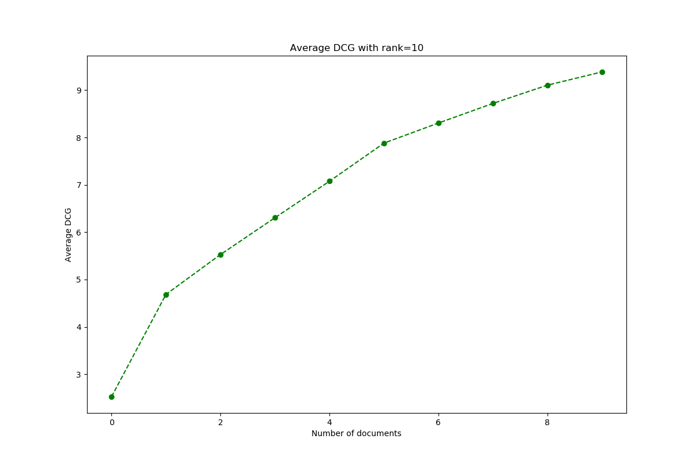
  
  
 ### nDCG
  | Query Number | nDCG | 
  ------------ | -------------
  1 | 0.4300161435335706
2 | 0
3 | 0.9047619047619048
4 | 0
5 | 0.6900845153874866
6 | 0.31546487678572877
7 | 0.6309297535714575
8 | 1.0
9 | 0.3154648767857287
10 | 1.0
11 | 0.893468810795955
12 | 0.3333333333333333
13 | 0
14 | 0.4937497188985746
15 | 0.7333333333333333
16 | 0.7250657854588236
17 | 0.6018342527778002
18 | 1.0
19 | 0.8999200247990146
20 | 0.9675851158608668
21 | 1.0
22 | 0.8035816388021916
23 | 0
24 | 0
25 | 0.5455081123298746
26 | 0.72953345464319
27 | 0.3010299956639812
28 | 0.9180385079206221
29 | 0
30 | 0
31 | 0.6867049889023985
32 | 0.38685280723454163
33 | 0.748718707326227
34 | 0.9608980633545894
35 | 0
36 | 0
37 | 0.8109665818057674
38 | 0.3333333333333333
39 | 0.7614382295165512
40 | 0.6546546217536686
41 | 1.0
42 | 1.0
43 | 0.5655228151937827
44 | 0.8879897593516443
45 | 0
46 | 0.38685280723454163
47 | 0.4744706689908244
48 | 0.3312732616136678
49 | 0.9676056886570377
50 | 1.0
51 | 0.33333333333333337
52 | 0
53 | 0.6756195170261932
54 | 0.6982987479970671
55 | 0
56 | 1.0
57 | 0.8524438057738482
58 | 0.5837327193618902
59 | 0.5335609179870577
60 | 0.38685280723454163
61 | 0.8055555555555556
62 | 0.6121654528982083
63 | 0.6309297535714575
64 | 0.4445412464587145
65 | 0.6013252687502619
66 | 0.43067655807339306
67 | 0.5138790902130886
68 | 0.946233076589537
69 | 0
70 | 0
71 | 1.0
72 | 0.6204510387155954
73 | 1.0
74 | 0.498969850408467
75 | 0.7411421869369462
76 | 1.0
77 | 0.8423643841708169
78 | 0.46724242515502096
79 | 0.6478128411036584
80 | 0.43470420928411624
81 | 0.33333333333333337
82 | 0.3562071871080222
83 | 1.0
84 | 0.8119439829657871
85 | 0
86 | 0.5061209964675134
87 | 0.7153382790366966
88 | 0.38685280723454163
89 | 0.7154858387573381
90 | 0.6678283390344937
91 | 0.8403128524054579
92 | 0.74844143852774
94 | 0.7623564092092044
95 | 0
96 | 0
97 | 0.32010173156855015
98 | 0.6309297535714575
99 | 0
100 | 0

  
**nDCG average**: 
  0.5483542851063729

  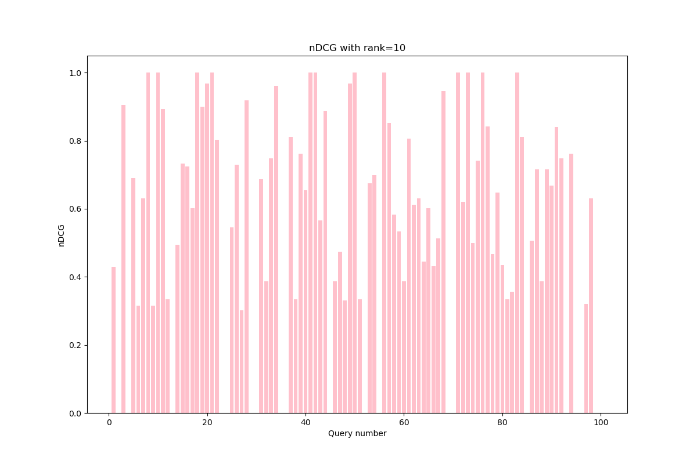
  
  
 ### R-Precision comparation
  | Query Number | R-Precision_stemmer -   R-Precision_nostemmer| 
  ------------ | -------------
  1 | 0.0
2 | 0.0
3 | -0.046511627906976744
4 | 0.0
5 | 0.030534351145038163
6 | -0.01260504201680672
7 | -0.07142857142857142
8 | 0.0
9 | 0.0
10 | 0.0
11 | -0.09090909090909088
12 | 0.0
13 | 0.08333333333333333
14 | -0.007359307359307399
15 | 0.025581395348837244
16 | -0.08683473389355745
17 | 0.0
18 | 0.05
19 | 0.0
20 | 0.021739130434782594
21 | 0.07999999999999999
22 | -0.005714285714285727
23 | 0.02857142857142857
24 | 0.0
25 | -0.005490196078431375
26 | -0.09090909090909091
27 | 0.09090909090909091
28 | 0.0025252525252525415
29 | 0.09343434343434345
30 | 0.0
31 | 0.05340622371740958
32 | 0.0
33 | 0.0016319869441044355
34 | 0.14285714285714285
35 | 0.0
36 | 0.0
37 | -0.19027484143763218
38 | 0.1509433962264151
39 | 0.06790123456790126
40 | 0.04945054945054944
41 | 0.0
42 | 0.043882978723404256
43 | 0.04545454545454547
44 | 0.17500000000000004
45 | 0.05
46 | 0.1111111111111111
47 | -0.033333333333333326
48 | 0.09999999999999998
49 | 0.027777777777777762
50 | 0.10444444444444445
51 | 0.15
52 | 0.0
53 | 0.0
54 | -0.04838709677419353
55 | 0.0
56 | 0.0
57 | 0.03921568627450983
58 | -0.02105263157894738
59 | 0.006896551724137945
60 | -0.05882352941176471
61 | -0.012153518123667384
62 | 0.027777777777777762
63 | -0.014906832298136646
64 | -0.14
65 | -0.03191489361702127
66 | 0.047619047619047616
67 | 0.0
68 | 0.022222222222222213
69 | 0.0
70 | 0.058823529411764705
71 | 0.0
72 | 0.0
73 | -0.05555555555555555
74 | 0.0
75 | 0.0
76 | 0.0
77 | -0.00848356309650053
78 | 0.3
79 | 0.06976744186046512
80 | -0.14935064935064937
81 | 0.03571428571428571
82 | 0.06451612903225808
83 | 0.055023923444976086
84 | 0.0
85 | 0.03225806451612903
86 | -0.0357142857142857
87 | 0.02631578947368421
88 | 0.0
89 | -0.09999999999999998
90 | -0.17857142857142855
91 | 0.029953917050691226
92 | 0.05555555555555555
94 | -0.19166666666666665
95 | 0.0
96 | -0.08333333333333333
97 | -0.09090909090909088
98 | -0.010256410256410262
99 | 0.0
100 | 0.0

  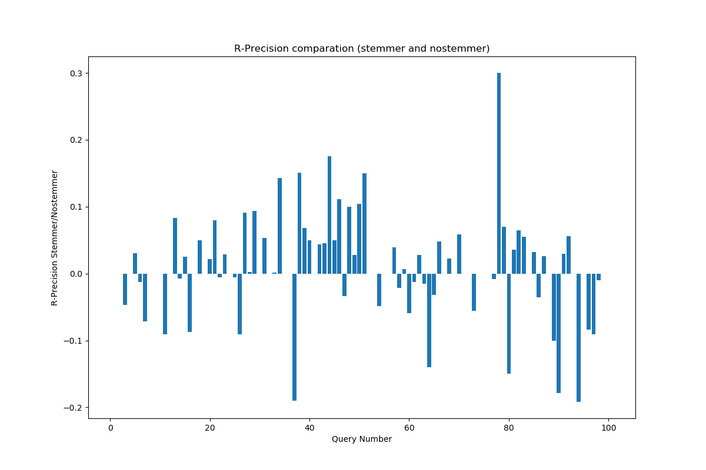
  